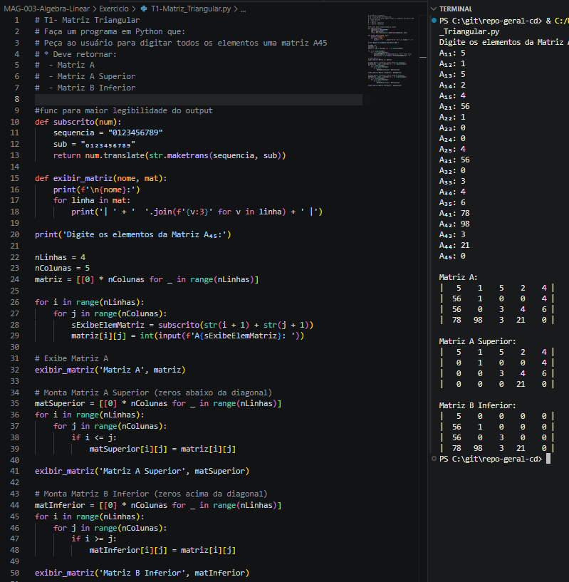
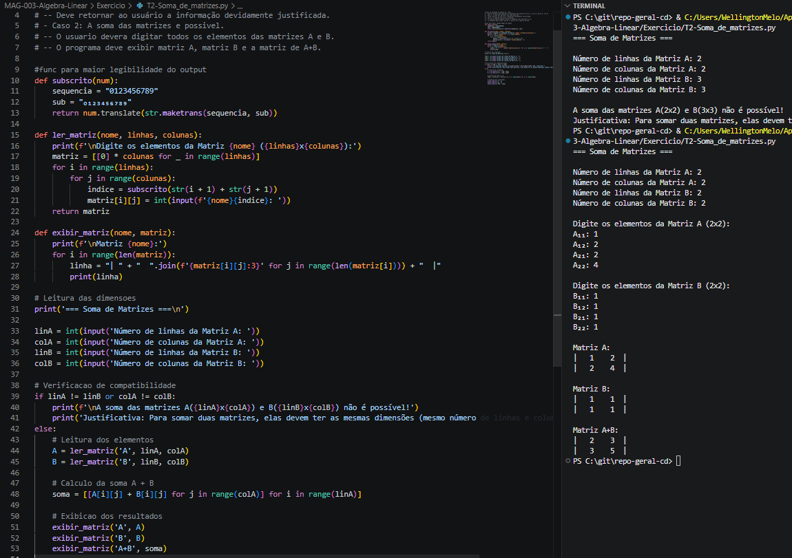
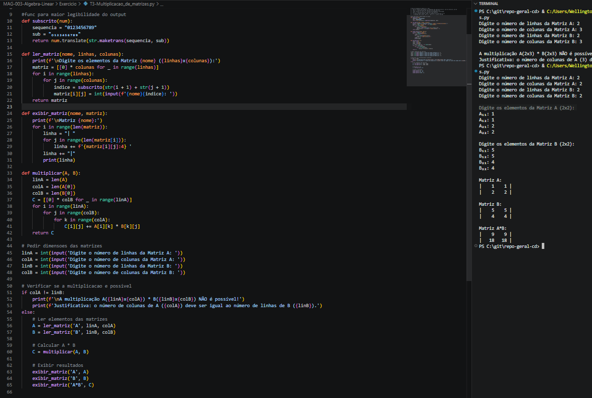

# Trabalhos de Algebra Linear — T1, T2 e T3

| | |
|---|---|
| **Curso** | Ciencia de Dados |
| **Periodo** | 2º Semestre |
| **Aluno** | Wellington Junior Torres de Melo |

---

## T1 — Matriz Triangular

### Codigo

```python
#func para maior legibilidade do output
def subscrito(num):
    sequencia = "0123456789"
    sub = "₀₁₂₃₄₅₆₇₈₉"
    return num.translate(str.maketrans(sequencia, sub))

def exibir_matriz(nome, mat):
    print(f'\n{nome}:')
    for linha in mat:
        print('| ' + '  '.join(f'{v:3}' for v in linha) + ' |')

print('Digite os elementos da Matriz A₄₅:')

nLinhas = 4
nColunas = 5
matriz = [[0] * nColunas for _ in range(nLinhas)]

for i in range(nLinhas):
    for j in range(nColunas):
        sExibeElemMatriz = subscrito(str(i + 1) + str(j + 1))
        matriz[i][j] = int(input(f'A{sExibeElemMatriz}: '))

# Exibe Matriz A
exibir_matriz('Matriz A', matriz)

# Monta Matriz A Superior (zeros abaixo da diagonal)
matSuperior = [[0] * nColunas for _ in range(nLinhas)]
for i in range(nLinhas):
    for j in range(nColunas):
        if i <= j:
            matSuperior[i][j] = matriz[i][j]

exibir_matriz('Matriz A Superior', matSuperior)

# Monta Matriz B Inferior (zeros acima da diagonal)
matInferior = [[0] * nColunas for _ in range(nLinhas)]
for i in range(nLinhas):
    for j in range(nColunas):
        if i >= j:
            matInferior[i][j] = matriz[i][j]

exibir_matriz('Matriz B Inferior', matInferior)
```

### Evidencia



---

## T2 — Soma de Matrizes

### Codigo

```python
#func para maior legibilidade do output
def subscrito(num):
    sequencia = "0123456789"
    sub = "₀₁₂₃₄₅₆₇₈₉"
    return num.translate(str.maketrans(sequencia, sub))

def ler_matriz(nome, linhas, colunas):
    print(f'\nDigite os elementos da Matriz {nome} ({linhas}x{colunas}):')
    matriz = [[0] * colunas for _ in range(linhas)]
    for i in range(linhas):
        for j in range(colunas):
            indice = subscrito(str(i + 1) + str(j + 1))
            matriz[i][j] = int(input(f'{nome}{indice}: '))
    return matriz

def exibir_matriz(nome, matriz):
    print(f'\nMatriz {nome}:')
    for i in range(len(matriz)):
        linha = "| " + "  ".join(f'{matriz[i][j]:3}' for j in range(len(matriz[i]))) + "  |"
        print(linha)

# Leitura das dimensoes
print('=== Soma de Matrizes ===\n')

linA = int(input('Numero de linhas da Matriz A: '))
colA = int(input('Numero de colunas da Matriz A: '))
linB = int(input('Numero de linhas da Matriz B: '))
colB = int(input('Numero de colunas da Matriz B: '))

# Verificacao de compatibilidade
if linA != linB or colA != colB:
    print(f'\nA soma das matrizes A({linA}x{colA}) e B({linB}x{colB}) nao e possivel!')
    print('Justificativa: Para somar duas matrizes, elas devem ter as mesmas dimensoes (mesmo numero de linhas e colunas).')
else:
    # Leitura dos elementos
    A = ler_matriz('A', linA, colA)
    B = ler_matriz('B', linB, colB)

    # Calculo da soma A + B
    soma = [[A[i][j] + B[i][j] for j in range(colA)] for i in range(linA)]

    # Exibicao dos resultados
    exibir_matriz('A', A)
    exibir_matriz('B', B)
    exibir_matriz('A+B', soma)
```

### Evidencia



---

## T3 — Multiplicacao de Matrizes

### Codigo

```python
#func para maior legibilidade do output
def subscrito(num):
    sequencia = "0123456789"
    sub = "₀₁₂₃₄₅₆₇₈₉"
    return num.translate(str.maketrans(sequencia, sub))

def ler_matriz(nome, linhas, colunas):
    print(f'\nDigite os elementos da Matriz {nome} ({linhas}x{colunas}):')
    matriz = [[0] * colunas for _ in range(linhas)]
    for i in range(linhas):
        for j in range(colunas):
            indice = subscrito(str(i + 1) + str(j + 1))
            matriz[i][j] = int(input(f'{nome}{indice}: '))
    return matriz

def exibir_matriz(nome, matriz):
    print(f'\nMatriz {nome}:')
    for i in range(len(matriz)):
        linha = "| "
        for j in range(len(matriz[i])):
            linha += f'{matriz[i][j]:4} '
        linha += "|"
        print(linha)

def multiplicar(A, B):
    linA = len(A)
    colA = len(A[0])
    colB = len(B[0])
    C = [[0] * colB for _ in range(linA)]
    for i in range(linA):
        for j in range(colB):
            for k in range(colA):
                C[i][j] += A[i][k] * B[k][j]
    return C

# Pedir dimensoes das matrizes
linA = int(input('Digite o numero de linhas da Matriz A: '))
colA = int(input('Digite o numero de colunas da Matriz A: '))
linB = int(input('Digite o numero de linhas da Matriz B: '))
colB = int(input('Digite o numero de colunas da Matriz B: '))

# Verificar se a multiplicacao e possivel
if colA != linB:
    print(f'\nA multiplicacao A({linA}x{colA}) * B({linB}x{colB}) NAO e possivel!')
    print(f'Justificativa: o numero de colunas de A ({colA}) deve ser igual ao numero de linhas de B ({linB}).')
else:
    # Ler elementos das matrizes
    A = ler_matriz('A', linA, colA)
    B = ler_matriz('B', linB, colB)

    # Calcular A * B
    C = multiplicar(A, B)

    # Exibir resultados
    exibir_matriz('A', A)
    exibir_matriz('B', B)
    exibir_matriz('A*B', C)
```

### Evidencia


